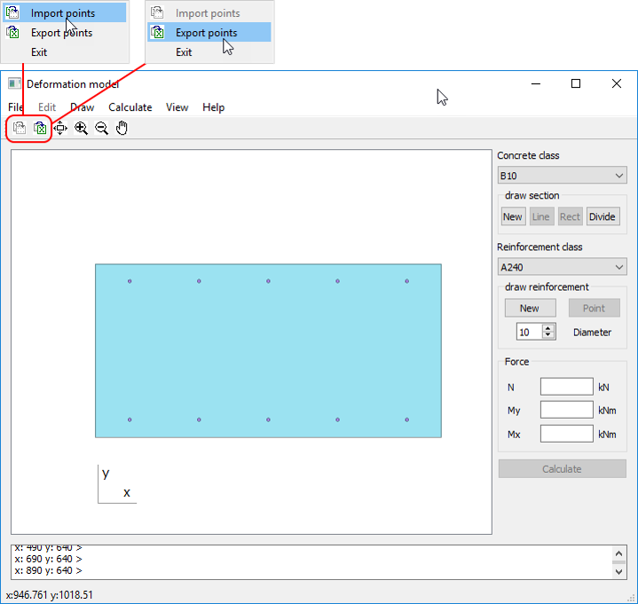

# Deformation Model

Program is made for calculate normal section of a reinforced concrete element using nonlinear deformation model
Trough this application, one can easily draw or load from Excel file a geometry of a reinforced concrete section and then calculate it on acting forces.
As a result acting stresses and strains will be outputed for every divided part of a section. 
The result cuold be saved in an excel file.

### Installing

One can install the program from the automated installer from the releases section.

## User Interface

1. – main menu
1. – buttons of:
 _import / export geometry from excel_
 _view navigation_
 
1. – model window
1. – command line
1. – status line (current coordinates) 
1. – input of the concrete class section
1. – input of the concrete section geometry section
1. – input of the reinforcement class section
1. – input of the reinforcement bar position
1. –input of the forces in the section
1. – begin of the calculation button

## Running the program

### Input of the concrete section geometry

Input of the concrete section geometry options:
1. – graphically by mouse in the window:
    __“Line”__ – user polygonal figure:
     input points, press “c” in conclusion
    __“Rect”__ – rectangle:
     input two opposite vertexes 
1. – in the command line in numerical form, in case of the user figure press “c”
in conclusion
Select concrete and reinforcement steel class

### Import / export of the geometry from Excel

EImplemented the possibility of loading previously saved coordinates of the specific points from Excel,
And saving of the coordinates of the designed elements to Excel 
by means of the ActiveX technology

### Concrete section division 

1. – “Divide” starts the concrete section division
1. – input of the number of divisions along the X axis (10 by default),
    input of the number of divisions along the Y axis (10 by default)
1. – the grid is shown in the window

### Input of position of the reinforcement bars

Select diameter for each reinforcement bar

Input of the coordinates of the reinforcement bars options:
1. – graphically by mouse in the window,       press “d” in conclusion
1. – in the command line in numerical form, press “d” in conclusion

### Input forces in the section and start the calculation

1. – input of the axial force N, bending moment My along Y axis, bending moment Mx along X axis
1. – start of the calculation, in case of successful result the select options window will appear
1. – select options for result visualization
1. – select option for save result in excel
1. – apply the choice and close the window buttons

### Result visualization

1. – compressed zone of the section
1. – stretched zone of the section
1. – stress in the concrete element
1. – stress in the reinforcement bar

Depending of the selected option on the window could be displayed:
   - stresses in MPa,
   - stresses in kg/sm2,
   - strains multiplied by 1000,
   - areas of the elements in sm2

## Built With

* [Qt Creator](https://www.qt.io/) - Qt Creator
* [Inno Setup](http://www.jrsoftware.org/isinfo.php) - Inno Setup

## Author

* **Denis Orlov** - [GitHub page](https://github.com/DOrlov74)

## License

This software is distributed under the terms and conditions of the GNU General Public License version 3.

